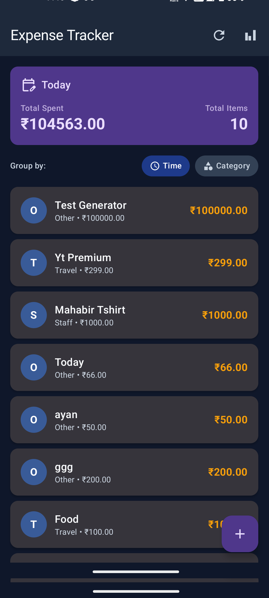
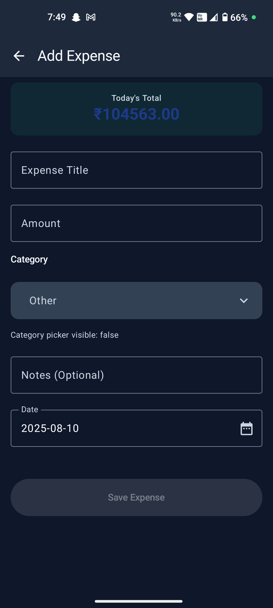
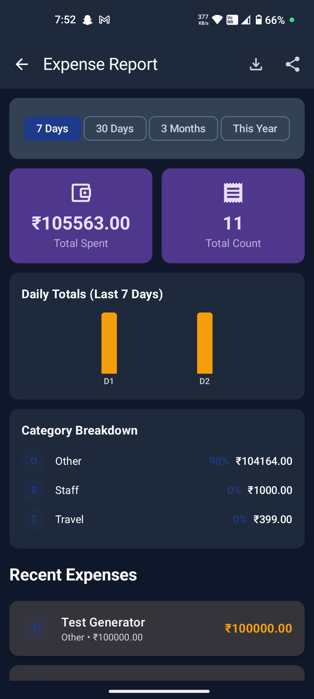
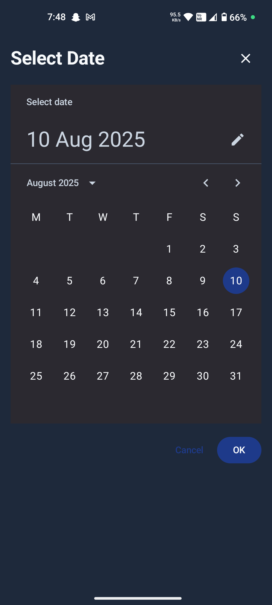

# ZoExpenseTracker 📱💰

A modern Android expense tracking application built with Jetpack Compose, Room database, and Material Design 3. Track your daily expenses, categorize spending, generate detailed reports, and export data in PDF/CSV formats.

## App Overview

ZoExpenseTracker is a comprehensive personal finance management app that helps users monitor their spending habits through an intuitive interface. The app features real-time expense tracking, smart categorization, detailed analytics, and seamless data export capabilities. Built with modern Android development practices, it provides a smooth user experience while maintaining data privacy and security.

## AI Usage Summary

This project was developed using AI assistance tools to streamline the development process and ensure best practices. ChatGPT was used for initial project structure planning, Jetpack Compose UI component design, and database schema optimization. GitHub Copilot assisted with code completion, error handling patterns, and Android-specific implementations. The AI tools helped accelerate development while maintaining code quality and following Android development guidelines.

## Key Features Implemented ✅

### Core Functionality
- **Expense Management**: Add, edit, and delete expenses with detailed information
- **Smart Categorization**: Pre-defined expense categories with custom support
- **Date-based Tracking**: Filter expenses by date ranges (Today, Last 7 days, Last 30 days, etc.)
- **Real-time Calculations**: Instant total amount and count updates

### Data Management
- **Local Database**: Room database with SQLite for offline data storage
- **Data Persistence**: Automatic data saving and retrieval
- **Search & Filter**: Find expenses by category, date, or amount
- **Data Export**: Generate PDF and CSV reports for external use

### User Interface
- **Material Design 3**: Modern, intuitive UI following Google's design guidelines
- **Jetpack Compose**: Declarative UI framework for smooth animations
- **Dark/Light Theme**: Adaptive theming system
- **Responsive Design**: Optimized for various screen sizes

### Reporting & Analytics
- **Visual Reports**: Category breakdown charts and daily spending trends
- **Period Selection**: Customizable report timeframes
- **Export Options**: PDF generation and CSV export
- **Share Functionality**: Easy sharing of reports via other apps

### Technical Features
- **MVVM Architecture**: Clean separation of concerns
- **Dependency Injection**: Hilt for efficient dependency management
- **Coroutines**: Asynchronous operations for smooth performance
- **Navigation**: Type-safe navigation with Compose Navigation

## Screenshots 📸

To add screenshots to your README:

1. **Take screenshots** of your app's main screens (Home, Add Expense, Reports, etc.)
2. **Save them** in a `screenshots/` folder in your project root
3. **Add them to README** using this format:

```markdown
## Screenshots 📸

| Home Screen | Add Expense | Reports |
|-------------|-------------|---------|
```





## APK Download 📥

[Download APK](https://drive.google.com/file/d/1PE-e6hNWGBKb3oqRZZIKE62LxGI0I7tc/view?usp=sharing)

### Prerequisites
- Android Studio Hedgehog or later
- Android SDK 24+ (API level 24)
- Kotlin 1.9.0+
- JDK 11

### Build Instructions
1. Clone the repository
```bash
git clone https://github.com/malik0011/ExpenseTracker
```

2. Open in Android Studio
3. Sync Gradle files
4. Build and run on device/emulator

### Dependencies
- **Jetpack Compose**: Modern UI toolkit
- **Room**: Local database
- **Hilt**: Dependency injection
- **Navigation Compose**: Navigation framework
- **Material 3**: Design system

## Architecture 🏗️

The app follows MVVM (Model-View-ViewModel) architecture with Clean Architecture principles:

- **Presentation Layer**: Compose UI components and ViewModels
- **Domain Layer**: Use cases and business logic
- **Data Layer**: Repository pattern with Room database
- **DI Layer**: Hilt for dependency management

## Contributing 🤝

1. Fork the repository
2. Create a feature branch
3. Commit your changes
4. Push to the branch
5. Open a Pull Request

## License 📄

This project is licensed under the MIT License - see the [LICENSE](LICENSE) file for details.

## Contact 📧

- **Developer**: Ayan Malik
- **Email**: ayanmalik.8334@gmail.com
- **GitHub**: [@malik0011]

---

⭐ **Star this repository if you find it helpful!**
